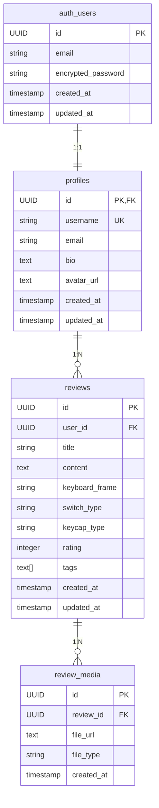

# 데이터베이스 스키마 문서

이 문서는 기계식 키보드 커뮤니티 애플리케이션의 데이터베이스 스키마를 설명합니다.

## ERD (Entity Relationship Diagram)

## 테이블 상세 설명

### 1. profiles (프로필 테이블)

사용자의 추가 정보를 저장하는 테이블입니다.

| 컬럼명     | 타입         | 제약조건         | 설명                        |
| ---------- | ------------ | ---------------- | --------------------------- |
| id         | UUID         | PK, FK           | auth.users 테이블의 id 참조 |
| username   | VARCHAR(50)  | UNIQUE, NOT NULL | 사용자명                    |
| email      | VARCHAR(255) | NOT NULL         | 이메일 주소                 |
| bio        | TEXT         | NULL             | 자기소개                    |
| avatar_url | TEXT         | NULL             | 프로필 이미지 URL           |
| created_at | TIMESTAMPTZ  | DEFAULT NOW()    | 생성일시                    |
| updated_at | TIMESTAMPTZ  | DEFAULT NOW()    | 수정일시                    |

### 2. reviews (리뷰 테이블)

키보드 리뷰 정보를 저장하는 테이블입니다.

| 컬럼명         | 타입         | 제약조건      | 설명                         |
| -------------- | ------------ | ------------- | ---------------------------- |
| id             | UUID         | PK            | 리뷰 고유 식별자             |
| user_id        | UUID         | FK, NOT NULL  | 작성자 ID (profiles.id 참조) |
| title          | VARCHAR(255) | NOT NULL      | 리뷰 제목                    |
| content        | TEXT         | NOT NULL      | 리뷰 내용                    |
| keyboard_frame | VARCHAR(255) | NULL          | 키보드 프레임                |
| switch_type    | VARCHAR(255) | NULL          | 스위치 타입                  |
| keycap_type    | VARCHAR(255) | NULL          | 키캡 타입                    |
| rating         | INTEGER      | CHECK (1-5)   | 평점 (1-5점)                 |
| tags           | TEXT[]       | DEFAULT '{}'  | 태그 배열                    |
| created_at     | TIMESTAMPTZ  | DEFAULT NOW() | 생성일시                     |
| updated_at     | TIMESTAMPTZ  | DEFAULT NOW() | 수정일시                     |

### 3. review_media (리뷰 미디어 테이블)

리뷰에 첨부된 이미지나 동영상 파일 정보를 저장하는 테이블입니다.

| 컬럼명     | 타입         | 제약조건      | 설명                      |
| ---------- | ------------ | ------------- | ------------------------- |
| id         | UUID         | PK            | 미디어 고유 식별자        |
| review_id  | UUID         | FK, NOT NULL  | 리뷰 ID (reviews.id 참조) |
| file_url   | TEXT         | NOT NULL      | 파일 URL                  |
| file_type  | VARCHAR(100) | NOT NULL      | 파일 타입                 |
| created_at | TIMESTAMPTZ  | DEFAULT NOW() | 생성일시                  |

## 인덱스

성능 최적화를 위해 다음과 같은 인덱스가 생성되어 있습니다:

- `idx_reviews_user_id`: 사용자별 리뷰 조회
- `idx_reviews_created_at`: 최신 리뷰 조회
- `idx_reviews_keyboard_frame`: 키보드 프레임별 검색
- `idx_reviews_switch_type`: 스위치 타입별 검색
- `idx_reviews_keycap_type`: 키캡 타입별 검색
- `idx_reviews_rating`: 평점별 검색
- `idx_review_media_review_id`: 리뷰별 미디어 조회

## 보안 정책 (RLS)

Row Level Security가 활성화되어 있으며, 다음과 같은 정책이 적용됩니다:

### profiles 테이블

- 모든 사용자가 프로필을 조회할 수 있음
- 사용자는 자신의 프로필만 수정/생성할 수 있음

### reviews 테이블

- 모든 사용자가 리뷰를 조회할 수 있음
- 인증된 사용자만 리뷰를 생성할 수 있음
- 사용자는 자신이 작성한 리뷰만 수정/삭제할 수 있음

### review_media 테이블

- 모든 사용자가 미디어를 조회할 수 있음
- 사용자는 자신의 리뷰에만 미디어를 추가할 수 있음
- 사용자는 자신의 리뷰 미디어만 삭제할 수 있음

## 자동 업데이트 트리거

`updated_at` 컬럼이 자동으로 업데이트되도록 트리거가 설정되어 있습니다:

- `update_profiles_updated_at`: profiles 테이블 업데이트 시
- `update_reviews_updated_at`: reviews 테이블 업데이트 시
